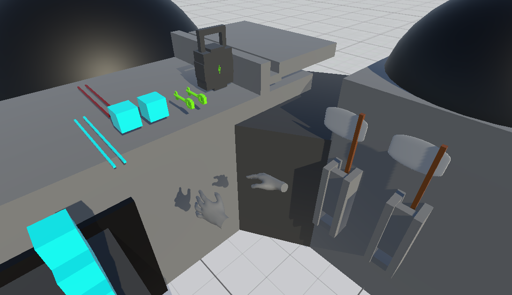

# VRPrototype

## Overview

**VRPrototype** is a work-in-progress Unity project used to experiment with and evaluate different approaches for physics-based interactions in virtual reality (for fun and for later use in other projects).

## Requirements

* **Unity Version:** `6000.3.20f1`
* **Hardware:** A VR headset and compatible VR controllers are required.

## Project Structure

Because this project is intended for experimentation, it intentionally contains multiple physics grab systems with overlapping functionality. This is so that different approaches could be compared with each other. These physics grab systems are categorized in high level categories:

* **ECS:** DOTS ECS-based grab system where physics hand and grabbables are moved using custom spring forces.
* **Grabbable Joint Driven (GrblJntDriven):** GameObject-based system where grabbables are driven directly by ConfigurableJoints connected to the world. During a grab, the physics hand is temporarily disabled and replaced by a **visual-only proxy hand** attached to the grabbable.
* **Hand Joint Driven (HandJntDriven):** GameObject-based system where grabbables are attached to physics hands via ConfigurableJoints. The physics hands are then driven by separate ConfigurableJoints connected to the world. This grab system can be less stable than the Grabbable Joint Driven system because it uses more physics constraints, but its joint setup more closely resembles how a hand grips an object in the real world.

Each system has its own dedicated test scene, located in **Assets → Scenes**:

* **EcsTestScene**
* **GrblJntDrivenTestScene** (includes the largest feature set)
* **HandJntDrivenTestScene**

## Controls

Use the grip buttons on your VR controllers to grab objects.

Note: The project has been tested only with HTC Vive controllers.

## Common Abbreviations

To distinguish between similar systems, names for the system features became quite long. To keep names manageable, a many abbreviations are used throughout the project:

|Abbreviation|Meaning|
|-|-|
|`dbl`|double|
|`dep`|depth|
|`fol`|follow|
|`gnr`|generic/general|
|`go`|game object|
|`grb` / `grbs`|grab / grabs|
|`grbl` / `grbls`|grabbable / grabbables|
|`grbr`|grabber|
|`invrs`|inverse|
|`jnt`|joint|
|`lcl`|local|
|`n`|and|
|`ofs`|offset|
|`phys`|physics|
|`piv`|pivot|
|`plr`|player|
|`pt`|point|
|`sgl`|single|
|`snp`|snap|
|`snpl`|snappable|
|`spc`|space|
|`st`|state|
|`tgt`|target|
|`theo`|theoretical|
|`trf`|transform|
|`vis`|visual|
|`wld`|world|

## NOTES

After compilation, the project will display the following warning several times. This is a known Unity issue:

[Unity Issue Tracker – ImporterNativeFormatImporter generated inconsistent result warnings](https://issuetracker.unity.com/issues/22603/importernativeformatimporter-generated-inconsistent-result-warnings-are-shown-for-openxrpackagesettingsasset-after-reopening-a-vr-template-project)